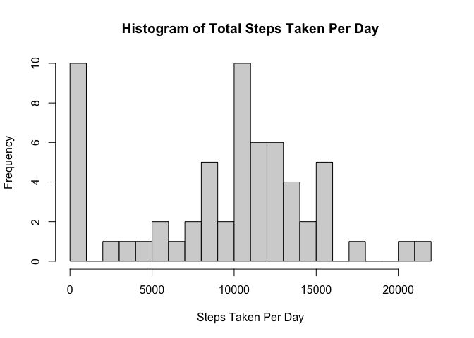
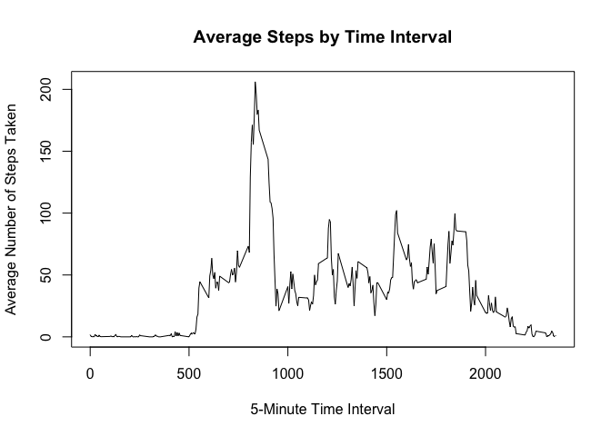
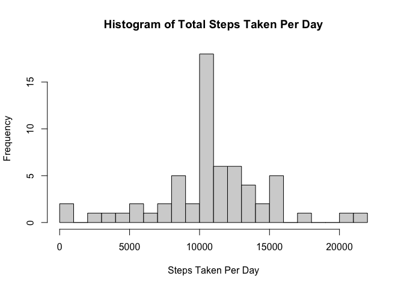
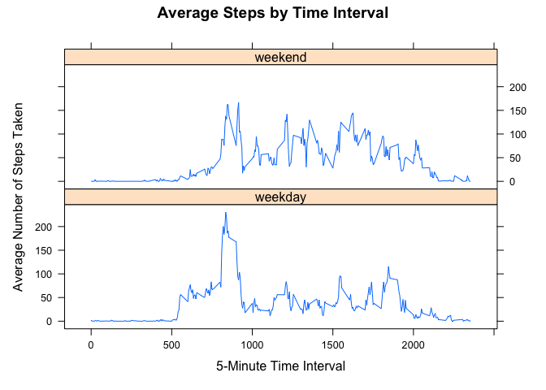

## Loading and preprocessing the data


```r
#load data
unzip("activity.zip")
data <- read.csv("activity.csv")

#convert data to data table
library(data.table)
data_table <- as.data.table(data)
```


## What is mean total number of steps taken per day?


```r
#calculate total number of steps per day
data_sum <- data_table[, list(tot_steps = sum(steps, na.rm = TRUE)), by = date]

#make histogram
hist(data_sum$tot_steps, breaks = 20, xlab = "Steps Taken Per Day", main = "Histogram of Total Steps Taken Per Day")
```

<!-- -->

```r
#calculate mean and median
meanstep <- round(mean(data_sum$tot_steps), 2)
print(meanstep)
```

```
## [1] 9354.23
```

```r
medstep <- median(data_sum$tot_steps)
print(medstep)
```

```
## [1] 10395
```

The mean of the total number of steps taken per day is 9354.23 and the median is 10395.

## What is the average daily activity pattern?


```r
#make time series plot
data_avg <- aggregate(x = list(avg_steps = data$steps), by = list(interval = data$interval), FUN = mean, na.rm = TRUE)
with (data_avg, {plot(interval, avg_steps, type = "l",
                      main = "Average Steps by Time Interval",
                      xlab = "5-Minute Time Interval",
                      ylab = "Average Number of Steps Taken")})
```

<!-- -->

```r
#find 5-min interval with the max number of steps
data_avg[which.max(data_avg$avg_steps),]
```

```
##     interval avg_steps
## 104      835  206.1698
```

The 5-minute interval with the maximum number of steps is interval 835.

## Imputing missing values


```r
#calculate total number of missing values
missingval <- sum(is.na(data$steps))
print(missingval)
```

```
## [1] 2304
```

The number of rows with missing values is 2304. We can fill in the missing values with the mean for the 5-minute interval.


```r
data_avg <- as.data.table(data_avg)
setkey(data_avg, interval)
setkey(data_table, interval)

#create function to replace values
replaceNA <- function(x, y) {
  if (is.na(x)) {
    return(y)
  }
  return(x)
}

#create a new data set with missing data filled in
data_new <- data_table[data_avg]
data_new$comp_steps <- mapply(replaceNA, data_new$steps, data_new$avg_steps)
datasum_new <- data_new[, list(tot_steps = sum(comp_steps, na.rm = TRUE)), by = date]

#make histogram
hist(datasum_new$tot_steps, breaks = 20, xlab = "Steps Taken Per Day", main = "Histogram of Total Steps Taken Per Day")
```

<!-- -->

```r
meanstep_new <- format(mean(datasum_new$tot_steps), digits = 2, nsmall = 2)
print(meanstep_new)
```

```
## [1] "10766.19"
```

```r
medstep_new <- format(median(datasum_new$tot_steps), digits = 2, nsmall = 2)
print(medstep_new)
```

```
## [1] "10766.19"
```

The new mean is 10766.19 and the new median is 10766.19. The new values differ from the old estimates. Imputing the missing values means the new median and mean are closer together since the missing values were replaced and doing so increased the median. 

## Are there differences in activity patterns between weekdays and weekends?


```r
#create new column for type of day
data_new$day_of_week <- weekdays(as.Date(data_new$date))

#determine if date is a weekday or weekend
part_of_week <- function(day) {
  if (day %in% c("Saturday", "Sunday")) {
    return("weekend")
  }
  return("weekday")
}

data_new$type_of_day <- as.factor(apply(as.matrix(data_new$day_of_week), 1, part_of_week))

#create panel plot
datasum_new <- data_new[, list(avg_steps = mean(comp_steps, na.rm = TRUE)), by = list(interval, type_of_day)]

library(lattice)
xyplot(avg_steps ~ interval | type_of_day, data = datasum_new,
       type = "l",
       main = "Average Steps by Time Interval",
       xlab = "5-Minute Time Interval",
       ylab = "Average Number of Steps Taken",
       layout = c(1,2))
```

<!-- -->
